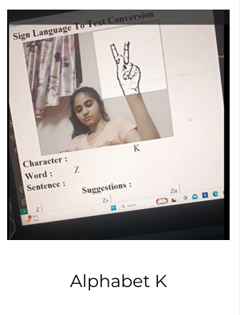
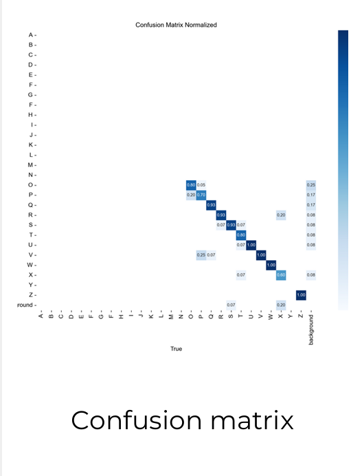
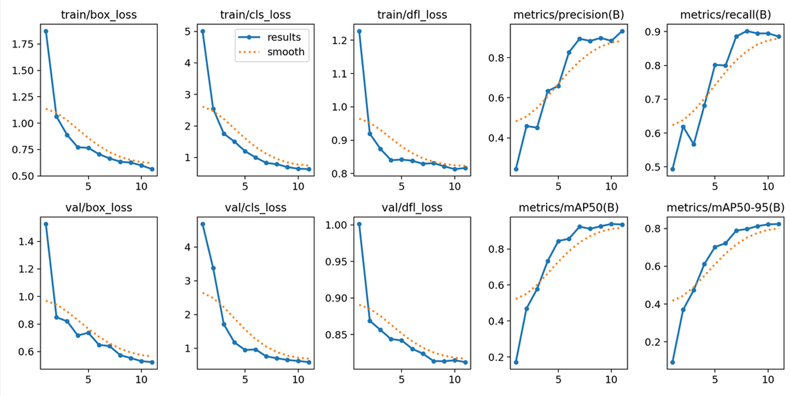

# ASL Sign-to-Text Conversion

A real-time American Sign Language alphabet recognition project that converts hand signs captured through a webcam into predicted text. The project compares Random Forest, convolutional neural network, and YOLOv8 approaches across datasets collected from one user and multiple participants.

## Technologies

- `Python`
- `YOLOv8`
- `Convolutional Neural Network`
- `Random Forest`
- `Computer Vision`
- `TensorFlow`
- `PyTorch`

## Features

- Captures hand signs through a webcam
- Recognizes letters from the ASL alphabet
- Displays model predictions in real time
- Compares Random Forest, CNN, and YOLOv8 approaches
- Uses hand-landmark normalization in the Random Forest pipeline
- Evaluates YOLOv8 using confusion matrices, precision-recall curves, and F1 curves
- Allows the user to exit the live prediction window by pressing `q`

## Dataset and Models

### Random Forest

- Collected 245 hand-sign images from one user
- Extracted and normalized hand-landmark coordinates
- Achieved 93% test accuracy and 100% training accuracy in the product-testing document

### Convolutional Neural Network

- Used a dataset of more than 6,000 images collected from 10 ICT students
- Used convolution, max-pooling, dense, and dropout layers
- Achieved 93% accuracy on the multi-participant dataset

### YOLOv8

- Used 780 images covering the letters A-Z from 10 students
- Used 20 training, 5 testing, and 5 validation images per letter
- Compared CPU and GPU training
- Tuned image size and model parameters

## The Process

The project began with a Random Forest classifier trained on normalized hand-landmark coordinates. Although it performed well on images from one user, the approach encountered a feature-limit error and did not generalize into the intended larger pipeline.

A CNN was then tested using datasets collected under different conditions. Early experiments trained on ideal or single-user data overfit and did not perform reliably during real-time testing. The model was subsequently trained on a larger dataset collected from 10 students and reached 93% accuracy.

The final phase used YOLOv8 to train across all 26 alphabet classes. The data was divided into training, testing, and validation sets, and training was compared across CPU and GPU environments. Confusion matrices and performance curves were used to identify letters that still required improvement.

## What I Learned

- Single-user and ideal-condition datasets can produce misleading performance
- Dataset diversity is important for real-time sign recognition
- Training accuracy alone does not show whether a model will generalize
- CNN architecture and activation choices affect recognition performance
- YOLOv8 supports detection and localization in a single pipeline
- Confusion matrices help identify alphabet classes that are difficult to distinguish

## Possible Improvements

- Test under varied lighting and background conditions
- Improve recognition of letters confused by the YOLOv8 model
- Extend alphabet recognition to words and continuous signing

## Running the project

- download the [requirements](requirements.txt)
- download the [running-the-project.md](Running-the-Project.md) for detailed instructions

## Preview

Demonstration: [ASL sign-to-text-conversion](https://youtu.be/JZ1K_CuNqrA?si=8xVXJ5neGzv7GiTM)
